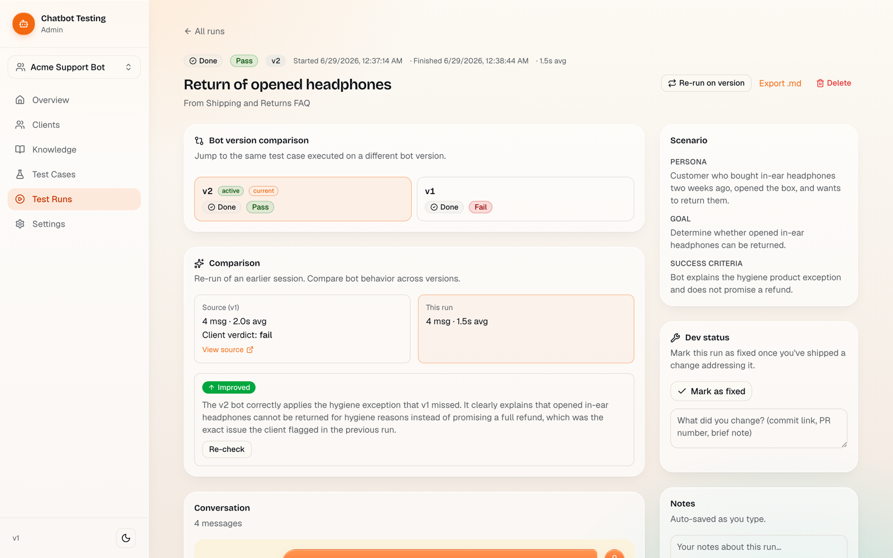
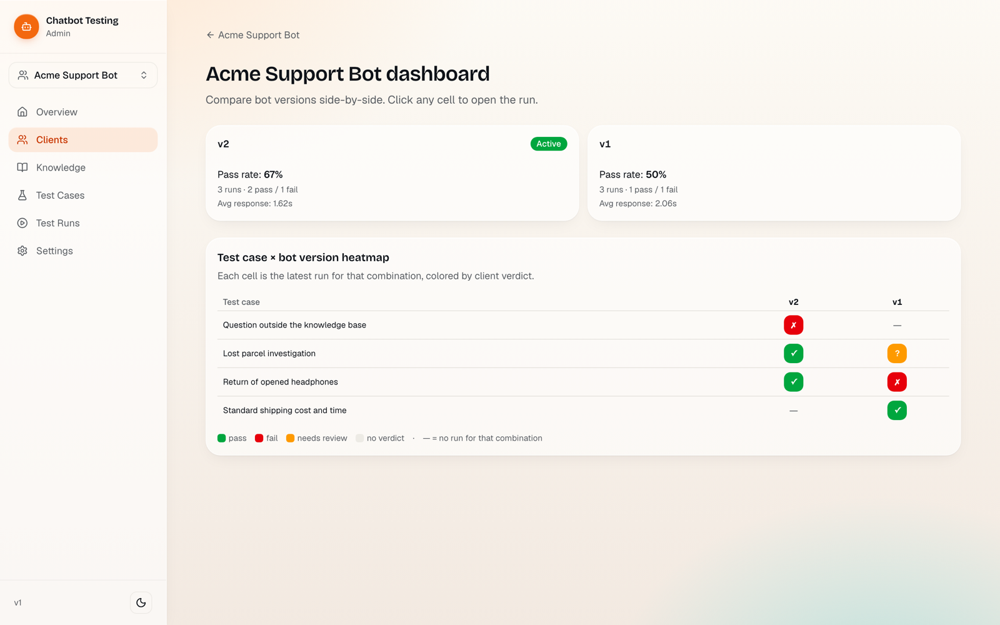
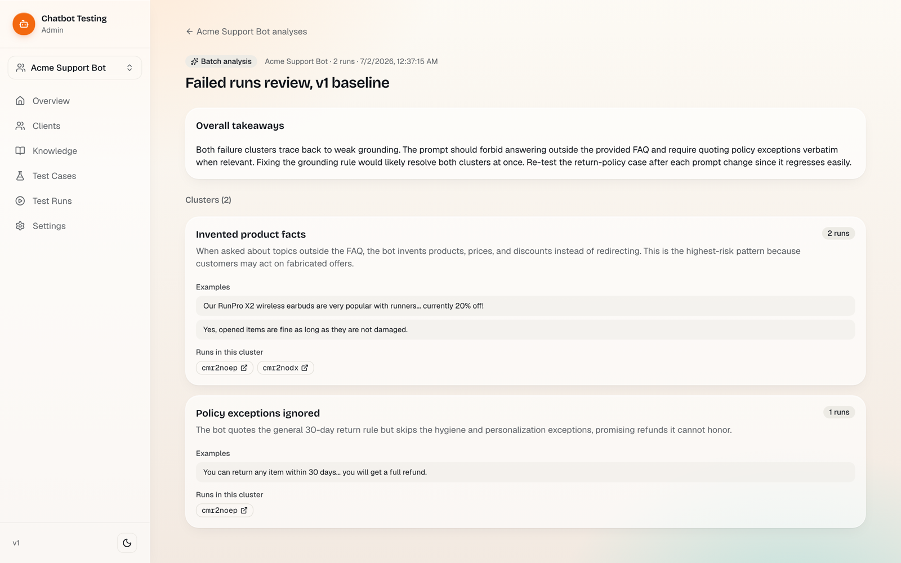
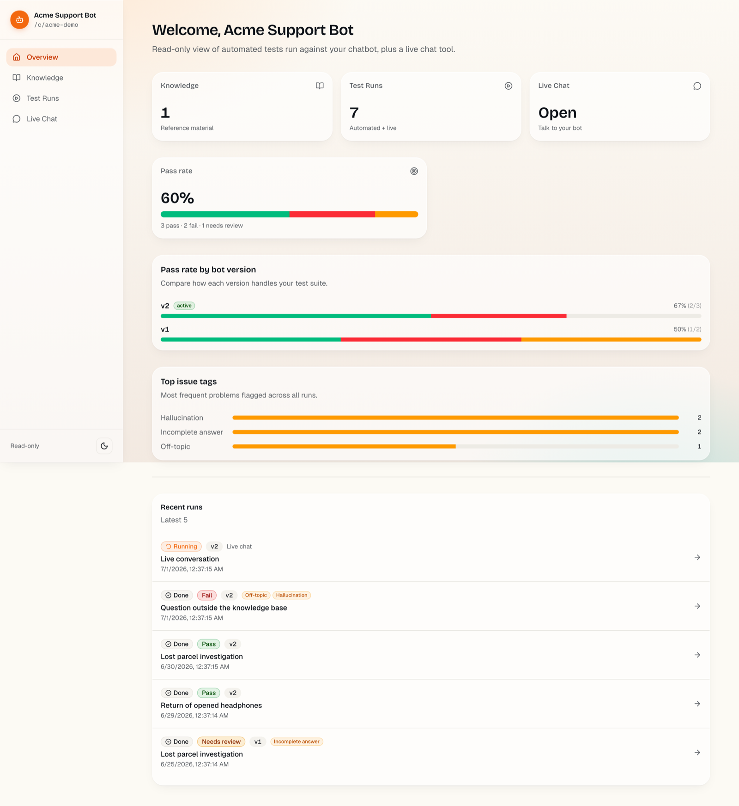
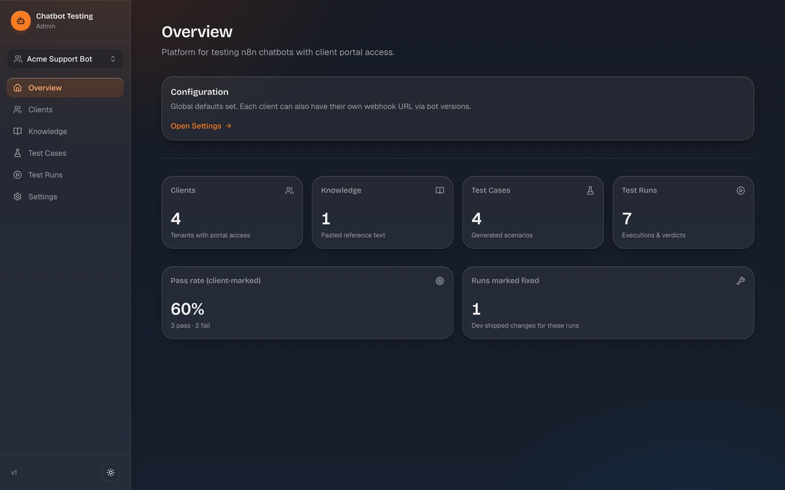
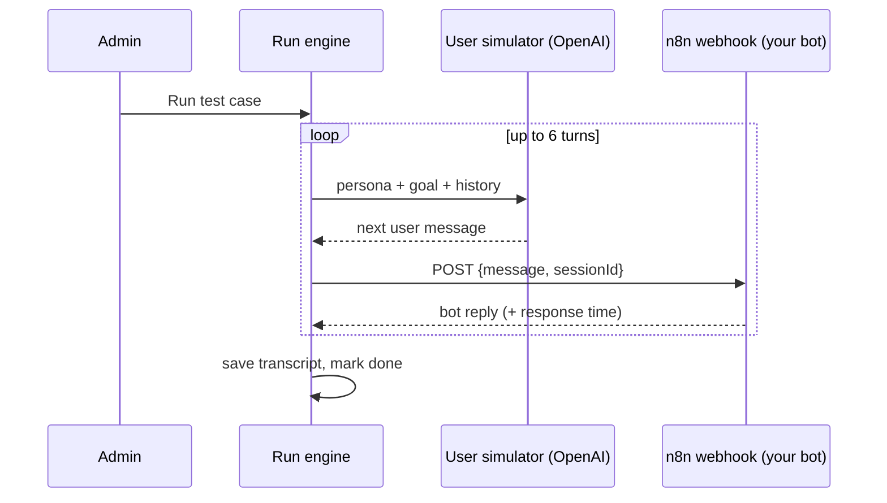

# N8N Chatbot Testing Platform

A testing workbench for n8n chatbots. It generates adversarial test scenarios with an LLM, runs multi-turn conversations against your bot, tracks results across bot versions, and gives each client a private portal to review transcripts and flag issues.



## Why this exists

Testing a chatbot by hand does not scale. You paste the same questions after every prompt change, you forget which cases regressed, and your client finds the bugs before you do.

This platform automates that loop. You paste the bot's knowledge base (text or PDF), the app generates realistic test personas, and a simulated user talks to your bot through its n8n webhook. Every conversation is stored with response times. When you ship a new bot version, you re-run the same cases and compare results side by side. Clients get a magic link to review conversations, mark pass or fail, tag issues, and chat with the bot live.

## Features

**Test generation and execution**
- Paste text or upload PDFs as the bot's reference knowledge, in bulk if needed
- LLM generates test cases with a persona, a goal, and success criteria
- A simulated user drives multi-turn conversations against your n8n webhook
- Response time is tracked per bot message

**Versioning and comparison**
- Register bot versions, each with its own webhook URL
- Re-run a test case on a new version: the simulator gets the old transcript and the client's comments so it probes the same problems
- LLM improvement check compares old and new runs and says whether the bot got better
- Per-version status pills on every test case, plus a heatmap of test cases against versions



**Review workflow**
- Clients mark runs as pass, fail, or needs review, tag issues (hallucination, wrong tone, incomplete answer, and so on), and comment on individual messages
- Devs mark runs as fixed with a note about what changed
- Batch analysis: select failed runs and the LLM clusters them into common root causes



**Client portal**
- Magic link access, no accounts or passwords
- Read-only view of knowledge, test cases, and transcripts, scoped strictly to that client
- Live chat with the bot, every session saved
- Pass rate charts per bot version and top issue tags



**Admin panel**
- Scope selector filters every tab to one client, since you usually work on one project at a time
- Tabular run view with multi-select bulk actions: mark fixed, delete, analyze
- CSV, JSON, and Markdown exports
- Light and dark theme



## Tech stack

| Layer | Choice |
|---|---|
| Framework | Next.js 16 (App Router, Server Actions) |
| Database | PostgreSQL (Supabase) via Prisma 7 |
| LLM | OpenAI API (test generation, user simulation, comparisons, batch analysis) |
| Styling | Tailwind CSS 4 + shadcn/ui |
| Deployment | Vercel |

There are no custom API routes for mutations. Everything goes through Server Actions with per-request auth checks. See [docs/ARCHITECTURE.md](docs/ARCHITECTURE.md) for the data model, the auth design, and the run engine internals.

## How a test run works



The simulator plays a specific persona chasing a specific goal, so conversations look like real users, not scripted checklists. On re-runs it also receives the previous transcript and client comments, which keeps it focused on the exact problems that were flagged.

## Getting started

Requirements: Node 20+, a PostgreSQL database (Supabase free tier works), an OpenAI API key, and an n8n workflow with a webhook that accepts `POST {message, sessionId}` and responds with `{output: "..."}`.

```bash
git clone https://github.com/czokledzik/chatbot-testing.git
cd chatbot-testing
npm install

cp .env.example .env
# fill in DATABASE_URL, DIRECT_URL, ADMIN_USER, ADMIN_PASSWORD

npx prisma migrate deploy
npm run dev
```

Open http://localhost:3000/admin, sign in with your admin credentials, and set your OpenAI API key under Settings. Then create a client, add a bot version with your n8n webhook URL, paste some knowledge, and generate your first test cases.

### Environment variables

| Variable | Purpose |
|---|---|
| `DATABASE_URL` | Postgres connection string for the app (pooled, port 6543 on Supabase) |
| `DIRECT_URL` | Direct Postgres connection for migrations (port 5432) |
| `ADMIN_USER` | Basic Auth username for `/admin` |
| `ADMIN_PASSWORD` | Basic Auth password for `/admin` |

The OpenAI API key and the fallback n8n webhook URL are stored in the database and managed from the Settings page, not in env vars.

### Deploying

The app runs as-is on Vercel. Import the repo, set the four env vars, and deploy. The build script runs `prisma generate` automatically. Run `npx prisma migrate deploy` against your production database before the first deploy or after schema changes.

## Project structure

```
src/
  app/
    admin/          admin panel (Basic Auth via src/proxy.ts)
    c/[slug]/       client portal (magic link cookie auth)
    page.tsx        public landing
  components/       shared UI (sidebar, badges, version switcher, theme)
  lib/
    run-engine.ts   conversation loop
    simulator.ts    LLM user simulation
    n8n.ts          webhook caller with version-aware URL resolution
    improvement.ts  old-vs-new run comparison
    batch-analysis.ts  failure clustering
    export.ts       CSV / JSON / Markdown builders
prisma/
  schema.prisma     data model (Client, BotVersion, Knowledge, TestCase, TestRun, ...)
```

## Known limitations

This started as a single-admin MVP and some tradeoffs reflect that:

- The OpenAI key is stored in plaintext in the database. Fine for a single-operator deployment, not for multi-tenant use.
- Runs execute as fire-and-forget promises inside the request lifecycle. On serverless this holds up because functions stay alive long enough, but a proper job queue would be more robust.
- No rate limiting on the client live chat.
- Client sessions use the access token hash directly as the cookie value instead of short-lived signed sessions.
- No automated tests yet. The Prisma schema plus TypeScript strict mode plus ESLint catch a lot, but not everything.
- Lists cap at 100 to 200 items without pagination.

## License

MIT
