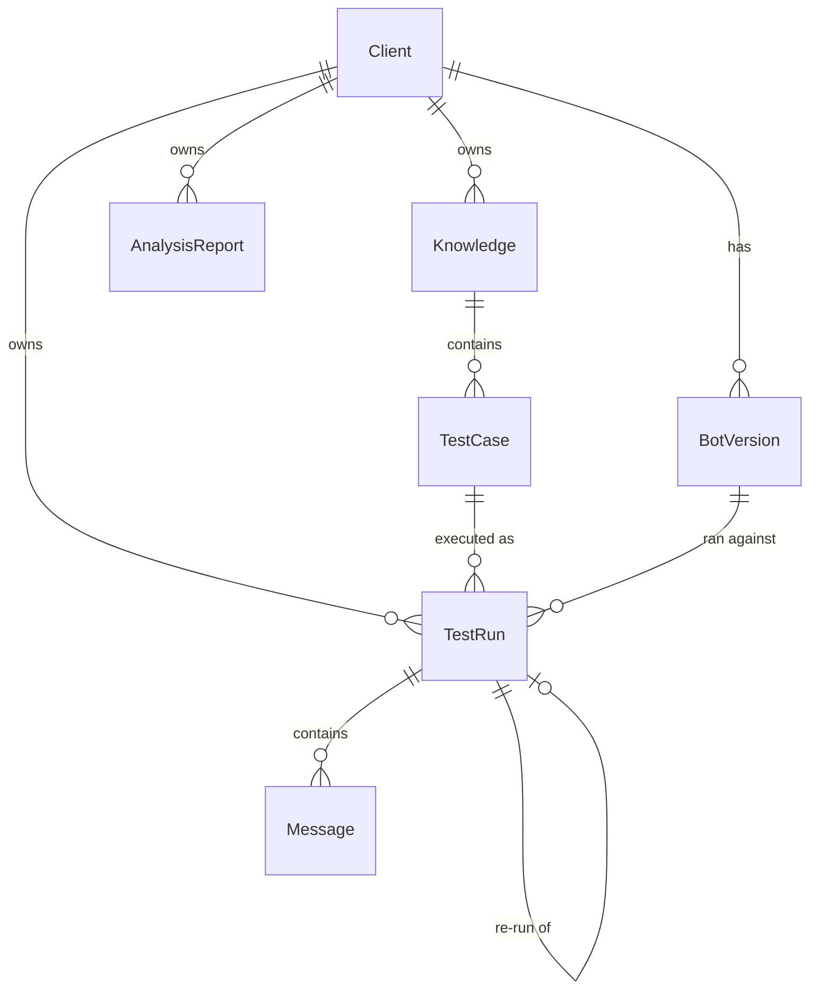

# Architecture

This document covers the data model, the two auth systems, the run engine, and how the LLM features are wired.

## Data model

Key decisions:

- **`Client` is the tenant boundary.** Every query in the client portal filters on `clientId`. `TestRun.clientId` is denormalized (it could be derived through TestCase and Knowledge) so that scoping queries stay flat and live chat runs, which have no test case, still belong to a client.
- **`BotVersion` carries the webhook URL.** The webhook resolution order is: explicit version on the run, then the client's active version, then the client's legacy URL, then the global fallback in Settings. This lets old runs keep pointing at the version they actually tested.
- **`TestRun.sourceRunId` links re-runs.** A re-run knows which earlier run it repeats, which powers the side-by-side comparison and the improvement check.
- **`Comment` is polymorphic** (`scope` + `targetId` instead of two foreign keys). Comments attach to either a run or a single message, and carry an `authorScope` of admin or client so both sides see who wrote what.
- **Review state lives on `TestRun`**: `clientVerdict` (pass / fail / needs-review), `clientVerifiedAt`, `issueTags` (Postgres text array), `devFixedAt`, `devFixNote`, `improvementVerdict`, `improvementReason`.

## Auth

There are two separate auth systems because there are two separate audiences.

### Admin: HTTP Basic Auth

`src/proxy.ts` (the Next.js middleware, called proxy since Next 16) guards `/admin/*`. Credentials come from `ADMIN_USER` and `ADMIN_PASSWORD` env vars. Two properties worth noting:

- **Fail-closed.** If the env vars are missing the middleware rejects everything rather than falling back to a default.
- **Constant-time comparison.** Both sides are hashed with SHA-256 before comparing, which avoids leaking string length or prefix matches through timing.

Basic Auth was chosen because there is exactly one operator. No user table, no session management, no password reset flow to build and break.

### Client portal: magic links

Each client has one access token. Only its SHA-256 hash is stored (`Client.accessTokenHash`); the raw token is shown to the admin exactly once at creation or rotation.

The flow:

1. Admin sends the client a link like `/c/acme/access?token=...`
2. The route handler (`src/app/c/[slug]/access/route.ts`) verifies the token against the stored hash using a timing-safe comparison, sets an httpOnly cookie scoped to `/c/acme`, and redirects to the clean URL.
3. Every server component and server action in the portal calls `requireClient(slug)`, which validates the cookie and returns the client row. All queries then filter on that client's id.

Cookies are named per slug, so one browser can hold sessions for multiple client portals without them interfering. Rotating the token invalidates all existing sessions at once because the cookie value no longer matches the new hash.

The important rule, enforced across the codebase: **the URL slug is never trusted by itself.** Ownership is always re-checked against the authenticated client id in the WHERE clause, so guessing another client's run id returns 404.

## Run engine

`src/lib/run-engine.ts` executes a test conversation:

1. Mark the run as `running`.
2. If the run has a `sourceRunId`, load the old transcript and any client comments as replay context.
3. Loop up to 6 turns:
   - Ask the simulator (`src/lib/simulator.ts`) for the next user message. The simulator is an OpenAI call with the persona, goal, success criteria, conversation history, and optional replay context. It returns structured JSON: the message plus a `done` flag it sets when the goal is reached or clearly unreachable.
   - POST the message to the resolved n8n webhook with a session id, measure the response time, store both messages.
4. Mark the run `done` (or `error` with the failure reason).

The engine is invoked as `void executeRun(id)` from a server action, so the HTTP response returns immediately and the UI polls for progress every two seconds. This is the simplest thing that works for conversations that take 30 to 90 seconds; a queue would be the next step if runs needed retries or strict durability.

Live chat sessions reuse the same tables. They are `TestRun` rows with `source: "live"` and no test case, and messages are appended by a server action instead of the engine loop.

## LLM features

All OpenAI calls use structured outputs (JSON schema mode) and validate the response with Zod before touching the database. The language of generated content (test cases, analyses, comparisons) follows a global setting, currently English or Polish.

| Feature | Input | Output |
|---|---|---|
| Test case generation | knowledge text, requested count | array of {title, persona, goal, successCriteria}, includes at least one out-of-knowledge probe to catch hallucinations |
| User simulator | persona, goal, history, optional replay context | next user message + done flag |
| Improvement check | old transcript + client verdict + comments, new transcript | improved / regressed / neutral + reasoning |
| Batch analysis | up to 30 transcripts with verdicts, tags, comments | issue clusters with examples + overall takeaways |

The one LLM feature that was removed on purpose: an automatic pass/fail judge that ran after every conversation. It kept flagging correct answers as hallucinations whenever the bot used knowledge from a different document than the one under test. Verdicts are now a human decision, and the LLM only assists with comparison and clustering, where it has full context and lower stakes.

## Multi-tenancy in the admin panel

Admins usually work on one client at a time, so the sidebar has a scope selector. The chosen client id is stored in a cookie and every admin list (knowledge, test cases, runs, overview stats) filters by it server-side. A `?client=` URL parameter can override the cookie for one request, which keeps deep links shareable.

## Exports

`src/lib/export.ts` builds three formats from the same query:

- **CSV**: one row per run with verdicts, tags, timing, version. For spreadsheets.
- **JSON**: full nested dump including transcripts and comments. For archiving or further processing.
- **Markdown**: a readable single-run report with the scenario, the conversation, and all comments. For sharing.

The client portal exposes only the CSV export, hard-scoped to the authenticated client.
